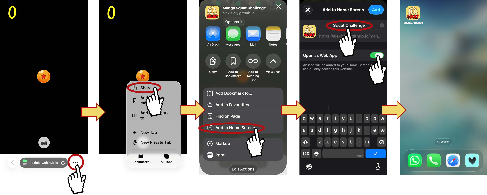

Become a legendary warrior by doing squats in Augmented Reality!

## How does it work?

1. Scan the QR code to launch the app on your smartphone
2. Allow the app to access the camera
3. Point the camera at the person who will be doing the squats. 
*The person must be fully visible from head to toe.*
4. Your turn: SQUAT ! SQUAT ! SQUAT ! SQUAT ! SQUAT !

Watch your transformation as the counter increases and become 
a **legendary warrior** !

Take a screenshot and share it on social media using the 
hashtags`#mangasquatchallenge` and `@bureims`

## Credits

This project was developped for the event "Sport et Manga", 
organised by the University Library of the University 
of Reims Champagne Ardenne, Reims, France.

> No personal information or images
> are stored by the application.

Alexis Laly, Ph.D in Biomechanics 

Olivier Nocent, Lecturer in Informatics and Sport Sciences

## Get the free app!

Like it? Get Manga Squat Challenge on your smartphone as a web app.
Here is an exemple on Iphone. 

---

Université de Reims Champagne Ardenne &copy; 2024

